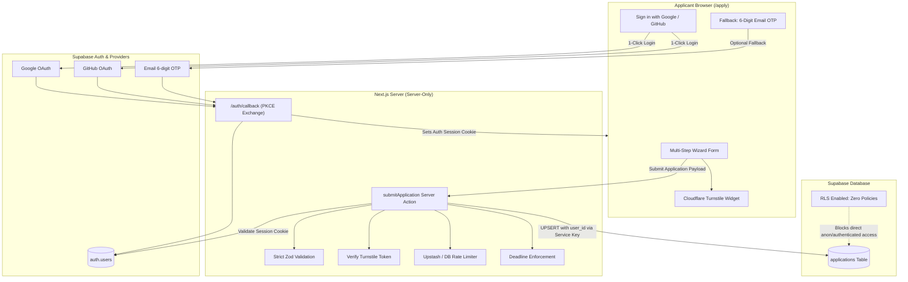

# HackCC 2026 Application System: Architecture & Implementation Plan

> **Status:** Proposal Refinement & Engineering Blueprint (v2 - Hybrid OAuth + OTP)  
> **Target Release:** HackCC 2026 Registration Launch  
> **Security Baseline:** Zero-trust client, Server-only DB access, Strict Zod + DB CHECK constraints, Google/GitHub OAuth + 6-Digit Email OTP Fallback.

---

## 1. What You Need to Do on Your End (User Prerequisite Checklist)

Before coding the backend or running migrations, several third-party services and operational decisions must be established by the team leads.

### A. Third-Party Accounts & Credentials

| Service | What to Set Up | Output Values Needed for `.env.local` |
| :--- | :--- | :--- |
| **Supabase** | 1. Create a new project (select region `us-west-1` / Northern California for lowest latency). 2. Enable 2FA on all team accounts invited. 3. Limit Supabase dashboard owners to at most 2 leads. 4. In Auth Settings, enable **"Link accounts with same email"**. 5. Note project URL and Service Role Key. | `SUPABASE_URL` `SUPABASE_SECRET_KEY` (service_role) *(Keep both strictly server-only!)* |
| **Google Cloud Console** *(OAuth)* | 1. Create project in [Google Cloud Console](https://console.cloud.google.com). 2. Configure OAuth Consent Screen ("HackCC 2026", basic scopes: `email`, `profile`). 3. Create OAuth 2.0 Client ID (Web Application). 4. Authorized Redirect URI: `https://<your-supabase-ref>.supabase.co/auth/v1/callback`. 5. Copy Client ID and Secret into Supabase Dashboard under Auth → Providers → Google. | *(Stored in Supabase Dashboard)* |
| **GitHub Developer** *(OAuth)* | 1. Go to GitHub Settings → Developer Settings → OAuth Apps → New OAuth App. 2. Application Name: `HackCC 2026`. 3. Homepage URL: `https://hackcc.org` (or localhost for dev). 4. Authorization callback URL: `https://<your-supabase-ref>.supabase.co/auth/v1/callback`. 5. Copy Client ID and Secret into Supabase Dashboard under Auth → Providers → GitHub. | *(Stored in Supabase Dashboard)* |
| **Cloudflare Turnstile** | 1. Log in to Cloudflare Dashboard → Turnstile. 2. Add widget for your domain (`hackcc.org` and `localhost` for testing). 3. Mode: "Managed" (non-interactive unless suspicious). | `NEXT_PUBLIC_TURNSTILE_SITE_KEY` `TURNSTILE_SECRET_KEY` |
| **Email Provider (Resend)** *(Fallback only)* | 1. Create free Resend account (Free tier: 100 emails/day is now **plenty** because ~95% of users will use OAuth). 2. Add custom sending domain and configure DNS records (SPF, DKIM, DMARC). | `RESEND_API_KEY` `EMAIL_FROM="HackCC <team@hackcc.org>"` |
| **Rate Limiter (Upstash Redis)** | *(Recommended for serverless)* 1. Create free Redis database on Upstash (US-West). 2. Used for distributed IP & email rate limiting. | `UPSTASH_REDIS_REST_URL` `UPSTASH_REDIS_REST_TOKEN` |

### B. Core Operational Decisions

- [ ] **Application Window Dates**:
  - `APPLICATIONS_OPEN_AT` (ISO 8601 string, e.g. `2026-10-01T00:00:00-07:00`)
  - `APPLICATIONS_CLOSE_AT` (ISO 8601 string)
  - **Grace Period**: 5–10 minutes to avoid dropping submissions started just before midnight.
- [ ] **Identity vs. Student Info Separation**:
  - **Auth Account**: Students sign in via Google, GitHub, or OTP to establish their persistent user session (`auth.users.id`).
  - **Application Form (Step 1)**: Still explicitly prompts for their official **Community College Name** and **Student Contact Email** (in case their personal Google/GitHub email differs from their student email).
  - **UI Note for School Emails**: Add a tip on login: *"Please use your personal Google or GitHub account; school-issued accounts frequently restrict external logins."*
- [ ] **Application Editing Policy**:
  - Students can revisit `/apply` at any time prior to `APPLICATIONS_CLOSE_AT` to review or update their submission (e.g. t-shirt size, dietary restrictions).
- [ ] **Reviewer Access**:
  - Non-admin organizers (reviewers/judges) will not be given raw Supabase project access.
  - Submissions will be accessed via a secure CLI CSV export script or a protected reviewer route.

---

## 2. Technical Implementation Architecture

---

## 3. Step-by-Step Implementation Breakdown

### Phase 1: Dependencies & Environment Setup
1. **Upgrade Next.js**:
   - Bump `next` and `eslint-config-next` in `package.json` to `>=16.3.6` to resolve security advisories (GHSA-p293-qw3h-jr36 and GHSA-2xp9-vwfh-vxw4).
   - Run `npm audit` to verify vulnerabilities are cleared.
2. **Environment Configuration**:
   - Create `.env.example` documenting all server and client variables.
   - Implement `src/lib/env.ts` using `zod` to validate all required environment variables at runtime.

### Phase 2: Database Schema & Zero-Trust Migration
1. **Migration File** (`supabase/migrations/20260927000000_create_applications.sql`):
   - Table: `applications`
   - Primary Key: `id uuid DEFAULT gen_random_uuid()`
   - Foreign Key: `user_id uuid UNIQUE REFERENCES auth.users(id) ON DELETE CASCADE`
   - Columns:
     - `full_name text NOT NULL`
     - `email text NOT NULL`
     - `phone text NOT NULL`
     - `college text NOT NULL`
     - `other_college text`
     - `age_confirmed boolean NOT NULL DEFAULT false`
     - `interests text[] NOT NULL`
     - `is_first_timer boolean NOT NULL DEFAULT false`
     - `tshirt_size text NOT NULL`
     - `dietary_restrictions text`
     - `code_of_conduct boolean NOT NULL DEFAULT false`
     - `status text NOT NULL DEFAULT 'submitted'` (values: `submitted`, `accepted`, `waitlisted`, `rejected`)
     - `created_at timestamptz DEFAULT now()`
     - `updated_at timestamptz DEFAULT now()`
2. **CHECK Constraints (Database Parity with Zod)**:
   - `CHECK (char_length(full_name) BETWEEN 2 AND 100)`
   - `CHECK (char_length(phone) BETWEEN 7 AND 25)`
   - `CHECK (tshirt_size IN ('S', 'M', 'L', 'XL', 'XXL'))`
   - `CHECK (age_confirmed = true)`
   - `CHECK (code_of_conduct = true)`
   - `CHECK (array_length(interests, 1) >= 1)`
3. **Security Lockdown**:
   - `ALTER TABLE applications ENABLE ROW LEVEL SECURITY;`
   - Zero RLS policies added (default DENY for all external operations).
   - `REVOKE ALL ON applications FROM anon, authenticated;`
   - `GRANT ALL ON applications TO service_role;`
   - Trigger for automatic `updated_at` updates.

### Phase 3: Server-Only Backend Architecture
1. **Server Isolation**:
   - Enforce `import "server-only"` across all database modules.
2. **Supabase Client Factories**:
   - `src/lib/supabase/server.ts`: Service Role client for administrative actions and DB mutations.
   - `src/lib/supabase/auth.ts`: Cookie-aware SSR client using `@supabase/ssr` to read session tokens (`supabase.auth.getUser()`).
3. **Auth Callback Route (`src/app/auth/callback/route.ts`)**:
   - Handles OAuth and OTP PKCE code exchange (`exchangeCodeForSession`).
   - Strictly validates `next` redirect target to prevent Open Redirect attacks (hardcoded whitelist: `/apply`).
4. **Cloudflare Turnstile (`src/lib/turnstile.ts`)**:
   - Validates submission tokens on server side against Cloudflare's verification endpoint.
5. **Rate Limiting (`src/lib/rateLimit.ts`)**:
   - Distributed rate limiter for submission attempts.

### Phase 4: Frontend Auth & Application Flow
1. **Authentication Gate / Header on `/apply`**:
   - If user is not authenticated:
     - Show clean sign-in options: **Continue with Google**, **Continue with GitHub**, and an expandable **"Use Email Code"** option.
     - Add helper caption: *"Please use your personal Google/GitHub account. School-issued accounts may restrict third-party logins."*
   - Once authenticated:
     - Header shows: `Signed in as user@example.com` + `Sign Out` button.
     - Student proceeds directly into the 4-step wizard.
2. **Application State & Pre-Filling**:
   - Check if an application row already exists for `user.id`.
   - If found:
     - Pre-fill all fields in the form.
     - Display info banner: *"Your application is on file! You can update your answers any time before applications close."*
     - Button updates from *"Submit Application"* to *"Update Application"*.

### Phase 5: Submission Server Action
1. **Server Action `submitApplication(formData, turnstileToken)`**:
   - Check application deadline: `now() <= APPLICATIONS_CLOSE_AT + GRACE_PERIOD`.
   - Verify Turnstile token.
   - Verify active session via `supabase.auth.getUser()`. If missing, return error.
   - Validate payload against server-side Zod schema.
   - Perform atomic `UPSERT` on `applications (user_id)`:
     - On insert: sets `status = 'submitted'`, records `created_at`.
     - On update: updates answers and updates `updated_at`.
   - Return clean sanitized confirmation `{ success: true, updatedAt: string }`.

### Phase 6: Organizer Operations & Security Documentation
1. **Admin Export CLI (`npm run export:applications`)**:
   - Script queries applications via `SUPABASE_SECRET_KEY` and outputs a sanitized CSV for reviewer evaluation.
2. **Security Headers in `next.config.ts`**:
   - `Content-Security-Policy`:
     - `default-src 'self'`
     - `script-src 'self' 'unsafe-eval' 'unsafe-inline' https://challenges.cloudflare.com`
     - `frame-src https://challenges.cloudflare.com https://accounts.google.com`
   - `X-Frame-Options: DENY`
   - `X-Content-Type-Options: nosniff`
   - `Referrer-Policy: strict-origin-when-cross-origin`
   - `Strict-Transport-Security: max-age=31536000; includeSubDomains; preload`
3. **SECURITY.md**:
   - Launch checklist, data retention & deletion instructions (90 days post-hackathon).

---

## 4. Verification & Testing Checklist

- [ ] **Public Key Direct Query Test**: Verify public Supabase client cannot query `applications` (`403 Forbidden`).
- [ ] **Cross-Account Protection**: Verify User A cannot read or modify User B's row.
- [ ] **Deadline Check**: Verify submissions after `APPLICATIONS_CLOSE_AT` are rejected.
- [ ] **Turnstile Protection**: Verify requests without valid Turnstile tokens fail.
- [ ] **OAuth & OTP Flow**: Verify successful session creation from Google, GitHub, and 6-digit email OTP.
